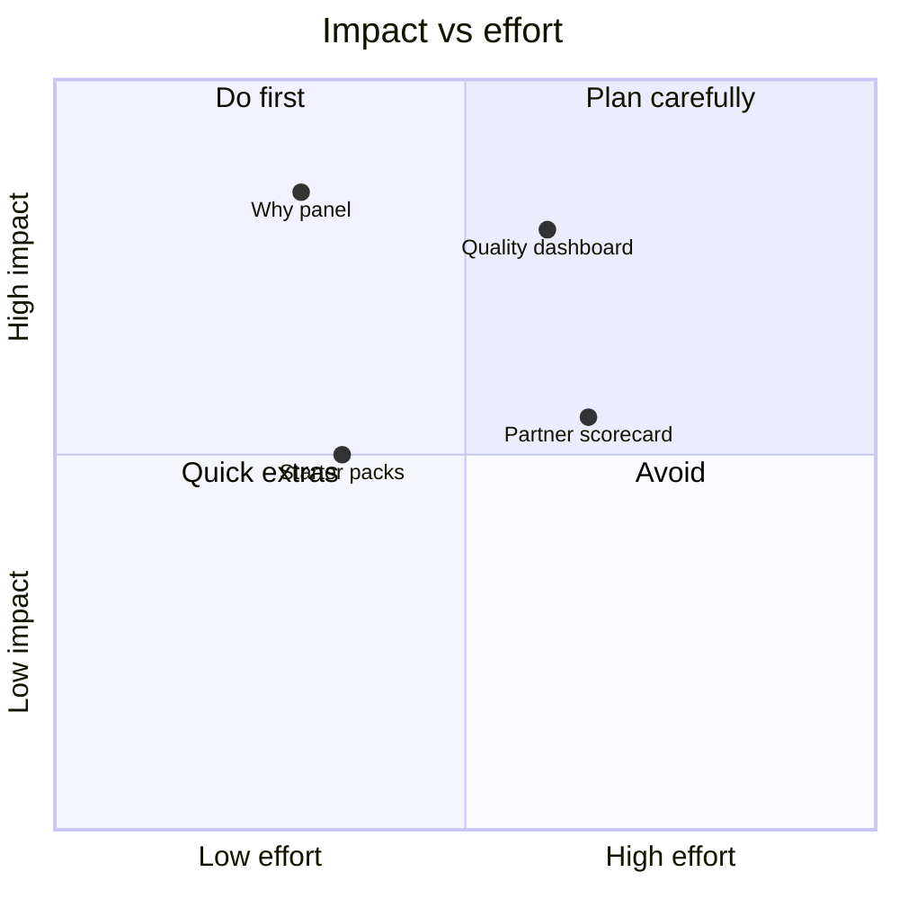
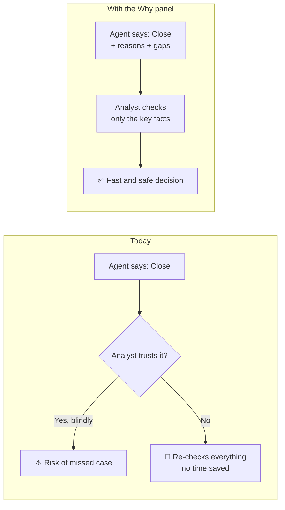
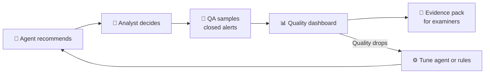
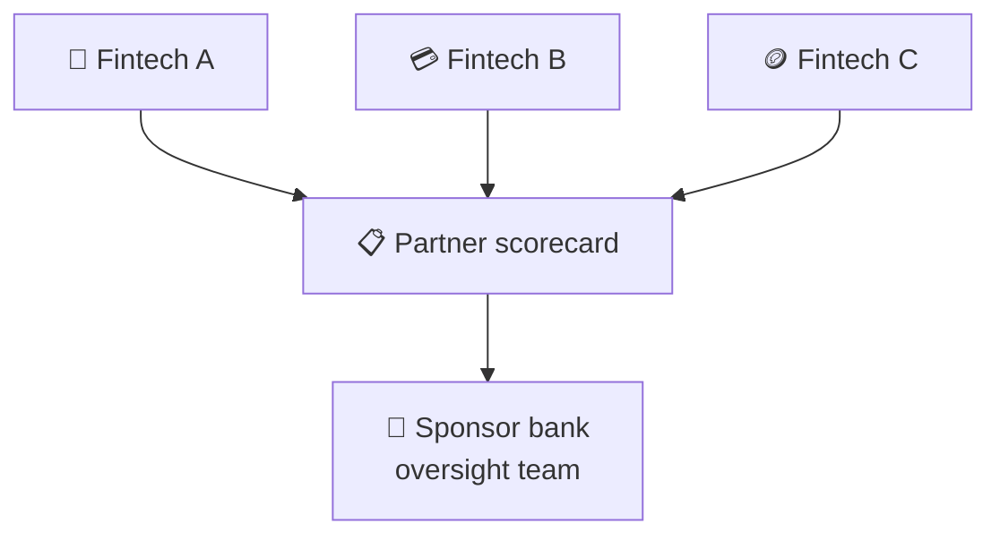
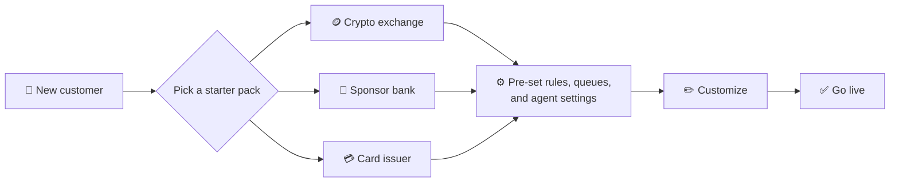

# Product Teardown: Oscilar AML Case Management + L1 Review Agent

*Author: Sathya Parthiban · September 2026*
*Written from the outside, using public sources only (Oscilar website, press releases, G2 reviews). I have no inside knowledge of the product.*

---

## 1. Product in one line

Oscilar is an AI risk platform for banks and fintechs. Its **AML case management** module, together with the **AML L1 Review Agent**, helps compliance teams turn alerts into investigations, decisions, and SAR filings faster.

## 2. The user and their problem

**Primary user:** L1 AML analyst at a fintech, sponsor bank, or bank.
**Secondary users:** L2 investigator, compliance manager / BSA officer, QA reviewer, examiner/auditor.

**The problem:**
- Transaction monitoring and screening create a large number of alerts. Oscilar says **about 95% of alerts are routine reviews**.
- For each alert, the analyst must collect data from many places (customer profile, transactions, device, past cases, watchlists) before making a decision.
- Fraud and AML teams often work in separate tools, so AML analysts repeat research that the fraud team already did.
- Every decision must be documented well enough for an auditor or regulator to understand *why* it was made.

**Result:** long queues, aging cases, inconsistent decisions, and slow SAR filing.

## 3. How it works today (from public information)

```
Alert (TM rule / screening hit / fraud signal)
        │
        ▼
AML L1 Review Agent
  - pulls customer history and context
  - analyzes the hit
  - recommends a disposition + drafts a narrative
        │
        ▼
Analyst reviews the case card
  (entities, alerts, devices, linked cases, AI summary)
        │
   ┌────┴─────┐
   ▼          ▼
Close      Escalate to L2 / case
             │
             ▼
   Investigation → AI-drafted SAR narrative → QA → File
```

Key building blocks:
1. **Case cards** – one view of the case with linked alerts, entities, devices, and history.
2. **Workflow automation** – assignment, prioritization, escalation, QA/QC, follow-ups.
3. **AI agents (Agent Hub, launched June 2026)** – 30+ agents, including AML L1 Review, Sanctions, SAR Narrative, and CTR Filing. They share one "risk memory," so a finding by one agent (for example, fraud disputes) is available to the next (for example, AML L1 review).
4. **Sponsor bank features** – fintech partners can escalate SAR/UAR alerts to the sponsor bank in one click.
5. **No-code rules + backtesting** – analysts can write or change rules (even in natural language) and test them on historical data before going live.

## 4. What works well

**1. Unified fraud + AML (FRAML) data.**
The biggest strength. The shared data layer and shared agent memory means an AML analyst sees what the fraud team found. This directly attacks the "repeat the research" problem, which point-solution competitors cannot easily copy.

**2. AI targets the right part of the work.**
The L1 agent focuses on the high-volume, low-risk alerts. That is where the most analyst time goes. Humans stay in control of the final decision, which fits how regulators expect AI to be used in AML.

**3. Built for the sponsor bank model.**
One-click escalation from fintech to sponsor bank solves a real, specific pain in the Banking-as-a-Service market, where oversight of partner fintechs is a major regulatory focus.

**4. Change without engineering.**
No-code rules plus backtesting let compliance teams tune detection in days instead of waiting for an engineering release.

## 5. What I would change

### At a glance

| | Idea | Who it helps | Main win |
|---|---|---|---|
| 🔍 | **1. "Why this recommendation" panel** | L1 analyst | Trust the agent faster |
| 📊 | **2. Agent quality dashboard** | Compliance leader / BSA officer | Prove AI quality to examiners |
| 🏦 | **3. Partner scorecard** | Sponsor bank | Compare fintech partners |
| 🚀 | **4. Starter packs for onboarding** | New customers | Go live faster |

**Where each idea sits (impact vs. effort):**



> Order I would build them: **1 → 2 → 4 → 3**. Idea 1 builds analyst trust, and Idea 2 proves that trust is safe. Together they unlock more automation.

---

### 🔍 Idea 1: "Why this recommendation" panel for every agent decision

**Problem:** When the agent says "close as false positive," the analyst must trust it or re-check everything. Too much trust = risk. Too little trust = no time saved.



**What the analyst would see:**

```text
┌──────────────────────────────────────────────────┐
│ 🤖 Recommendation: CLOSE – False positive        │
│ Confidence: ████████░░  High                     │
├──────────────────────────────────────────────────┤
│ Why:                                             │
│  ✅ Date of birth does not match (1984 vs 1962)   │
│  ✅ Country does not match (Brazil vs Iran)       │
│  ✅ Same hit cleared 3 times in last 12 months    │
│ Not checked / missing:                           │
│  ⚠️ No address on file for the customer           │
│ Would change my mind if:                         │
│  ➜ Address matches the listed entity             │
├──────────────────────────────────────────────────┤
│ [ Accept ]   [ Override ]   [ Escalate to L2 ]   │
└──────────────────────────────────────────────────┘
```

**Why I believe in this:** In my own work on a watchlist-screening match explainer, showing *why* a name matched helped analysts decide faster and with more confidence.
**Tradeoff:** More information on the screen. Needs careful design so it stays scannable.

---

### 📊 Idea 2: Agent quality dashboard for compliance leaders

**Problem:** As agents close more alerts, the BSA officer needs proof that quality is not dropping. Examiners will ask how the AI is monitored.



**What the dashboard would show:**

```text
┌────────────────── Agent Quality – Last 30 days ──────────────────┐
│ Override rate          12%   ▼ from 18%    🟢                     │
│ QA error rate (agent)  1.1%  vs manual 1.4% 🟢                    │
│ Late escalations       3     ▲ from 1      🟠 review needed       │
│                                                                   │
│ Override rate by alert type                                       │
│  Sanctions hit     ██░░░░░░░░  8%                                 │
│  Structuring       ████░░░░░░ 15%                                 │
│  Rapid movement    ██████░░░░ 22%  ⚠️                              │
│                                                                   │
│ [ Export evidence pack for audit ]                                │
└───────────────────────────────────────────────────────────────────┘
```
*(Numbers are made-up examples to show the layout.)*

**It tracks:**
- analyst override rate of agent recommendations (by alert type, by rule)
- QA error rate on agent-assisted closes vs. fully manual closes
- "late escalations" – alerts closed by L1 that later became SARs
- an exportable evidence pack for model risk / audit reviews

**Tradeoff:** Requires a proper QA sampling process, which adds some work for QA teams.

---

### 🏦 Idea 3: Partner quality scorecard for sponsor banks

**Problem:** A sponsor bank oversees many fintechs. Today it can receive escalations, but it is hard to compare how well each partner runs its program.



**Example scorecard:**

| Partner | Alerts / month | Cases older than 30 days | Escalations that became SARs | QA findings | Status |
|---|---|---|---|---|---|
| 📱 Fintech A | 4,200 | 3% | 40% | 1 | 🟢 Healthy |
| 💳 Fintech B | 9,800 | 14% | 12% | 6 | 🟠 Watch |
| 🪙 Fintech C | 2,100 | 22% | 5% | 9 | 🔴 Needs action |

*(Made-up example data.)* A low "escalations that became SARs" rate can mean a partner escalates too much low-quality work.

**Tradeoff:** Sensitive — fintechs may not want to be ranked. Needs clear permissions and agreed definitions.

---

### 🚀 Idea 4: Faster onboarding for new customers

**Problem:** G2 reviewers mention a real learning curve and implementations taking longer than planned, because the platform is very flexible.

**Change:** Starter packs by customer type, plus a guided setup checklist.



**Before vs. after (illustrative):**

```text
Today:        [Setup from scratch ─────────────────────] ➜ Go live
With packs:   [Starter pack ──][Customize ────] ➜ Go live   ⏱️ faster
```

**Tradeoff:** Templates can push customers into generic setups. They must stay easy to customize.

## 6. How I would measure success

**North star:** *Alerts correctly resolved per analyst hour.*
("Correctly" = passes QA and is not later reversed.) This balances speed and quality, so the team cannot win by closing alerts carelessly.

**Supporting metrics:**
| Metric | Why it matters |
|---|---|
| Average L1 review time per alert | Direct measure of time saved |
| Agent recommendation acceptance rate | Shows analyst trust in the agent |
| Case aging (% older than X days) | Queue health |
| Time from escalation to SAR filed | Regulatory deadline risk |
| False-positive rate of alerts | Detection quality |

**Guardrail metrics (must not get worse):**
- QA error rate on agent-assisted closes
- Late escalations (closed alerts that later became SARs)
- Regulatory / audit findings related to case documentation

## 7. Risks and open questions

- **Over-trust in AI:** If analysts accept recommendations without reading them, errors can pass through. How does Oscilar detect "rubber-stamping"?
- **Regulator acceptance:** How much of the L1 decision can be automated before examiners push back? Does this differ by country?
- **Shared memory and privacy:** When fraud and AML agents share memory, how are access rules and SAR confidentiality protected?
- **Measuring "95% routine":** How is a "routine" alert defined, and how often is that label wrong?
- **Pricing:** One G2 reviewer calls the price high. Does the agent value justify it for smaller fintechs?

## 8. Questions I would ask the Oscilar team

1. What is the current acceptance rate of L1 agent recommendations, and what drives overrides?
2. How do customers review and approve an agent before letting it act on live alerts?
3. What is the biggest source of friction for analysts in case management today?
4. How do sponsor banks and their fintech partners share cases in practice?

---

### Sources
- Oscilar homepage and Agent Hub pages – oscilar.com, oscilar.com/ai/agents
- Oscilar AI Case Management – oscilar.com/solutions/case-management
- AML for Sponsor Banks – oscilar.com/solutions/aml-for-sponsor-banks
- Agent Hub launch press release (June 3, 2026) – PR Newswire
- "Introducing the Oscilar Agent Hub" blog (July 2026) – oscilar.com/blog/oscilar-agent-hub
- Oscilar 2025 Year in Review – oscilar.com/blog/2025
- Oscilar reviews – g2.com/products/oscilar/reviews
